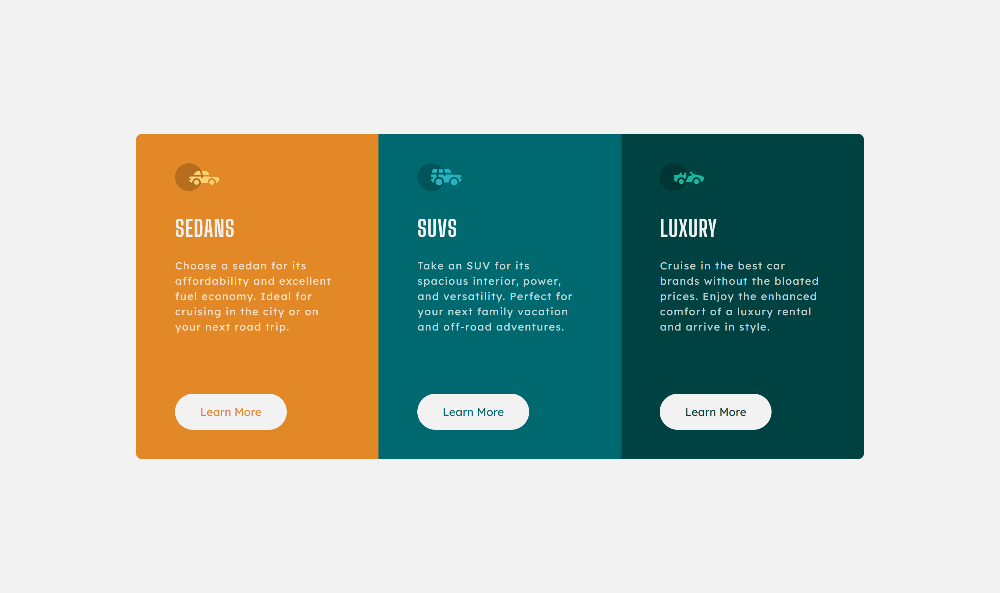
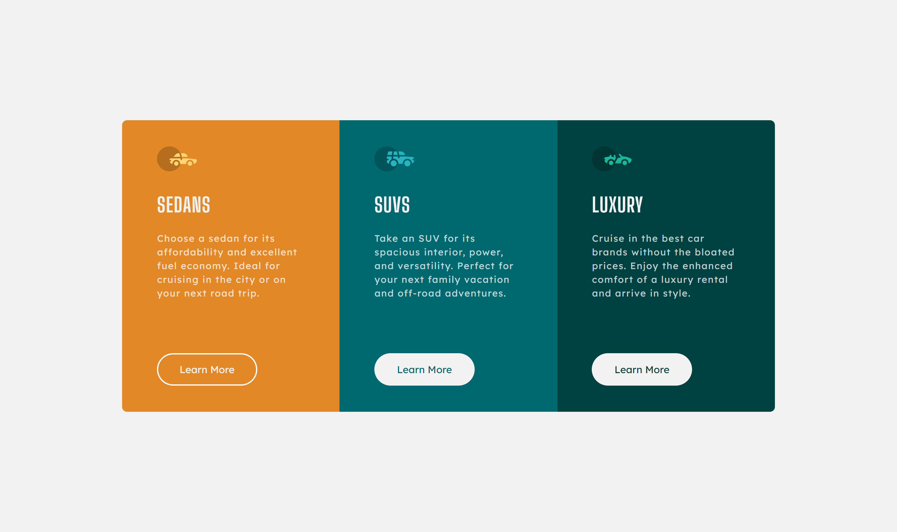
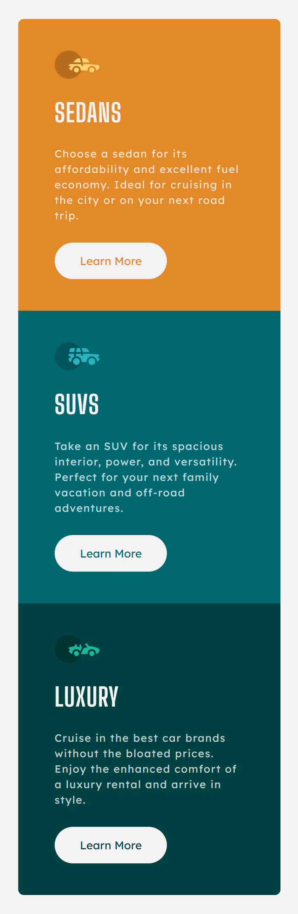

# Frontend Mentor - 3-column preview card component solution

This is a solution to the [3-column preview card component challenge on Frontend Mentor](https://www.frontendmentor.io/challenges/3column-preview-card-component-pH92eAR2-). Frontend Mentor challenges help you improve your coding skills by building realistic projects. 

## Table of contents

- [Overview](#overview)
  - [The challenge](#the-challenge)
  - [Screenshot](#screenshot)
  - [Links](#links)
- [My process](#my-process)
  - [Built with](#built-with)
  - [What I learned](#what-i-learned)
  - [Continued development](#continued-development)
  - [Useful resources](#useful-resources)
- [Author](#author)

## Overview

### The challenge

Users should be able to:

- View the optimal layout depending on their device's screen size
- See hover states for interactive elements

### Screenshot

Desktop



Desktop (Hover)



Mobile



### Links

- [Solution URL](https://github.com/radiantlegends/radiantlegends.github.io/tree/main/3-column-preview-card-component)
- [Live Site URL](https://radiantlegends.github.io/3-column-preview-card-component)

## My process

### Built with

- Visual Studio Code
- HTML / CSS
- SCSS
- Flexbox
- CSS Grid
- Mobile-first workflow

### What I learned

I am enjoying how grids function in CSS. The following code was fun to figure out and work with. Flexbox is still nice for quick arrangements, but I d not find it fun to work with.


```css
.grid {
  display: grid;
  grid-template-columns: 1fr;
  border-radius: 0.5rem;
  overflow: hidden;

  @include min(phone) {
    grid-template-columns: repeat(3, 1fr);
  }

  &__item {
    display: flex;
    flex-flow: column;
    align-items: baseline;
  }
}
```

### Continued development

I am satisfied with the state of this project. I will continue to practice Sass, flexbox, and grids.

### Useful resources

- [A Complete Guide to Grid](https://css-tricks.com/snippets/css/complete-guide-grid/) - Extremely helpful resource for learning CSS grids.
- [Aligning Last Item](https://wpbeaches.com/aligning-last-item-bottom-container-flexbox/) - This helped me align the buttons, no matter how long the paragraph above it was.

## Author

- Frontend Mentor - [@radiantlegends](https://www.frontendmentor.io/profile/radiantlegends)
- Upwork - [Kimberly S.](https://www.upwork.com/freelancers/~0193e4cf5120bb4dc5)