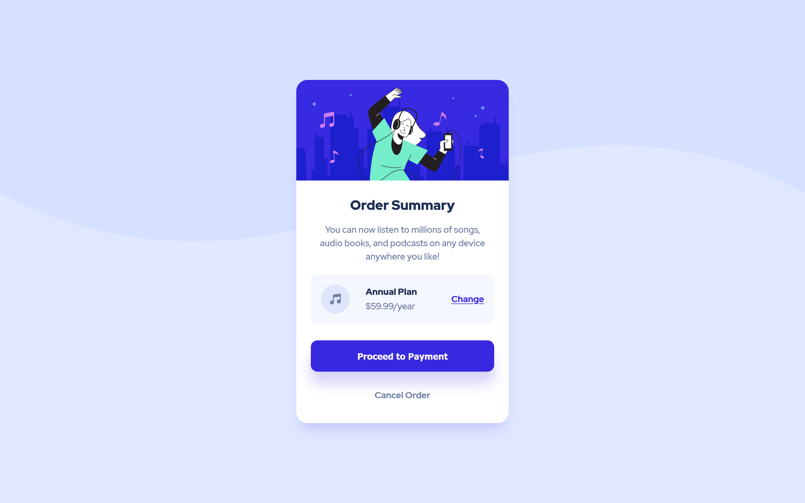

# Frontend Mentor - Order summary card solution

This is a solution to the [Order summary card challenge on Frontend Mentor](https://www.frontendmentor.io/challenges/order-summary-component-QlPmajDUj). Frontend Mentor challenges help you improve your coding skills by building realistic projects. 

## Table of Contents

- [Overview](#overview)
  - [The challenge](#the-challenge)
  - [Screenshot](#screenshot)
  - [Links](#links)
- [My process](#my-process)
  - [Built with](#built-with)
  - [What I learned](#what-i-learned)
  - [Continued development](#continued-development)
  - [Useful resources](#useful-resources)
- [Author](#author)
- [Acknowledgments](#acknowledgments)

## Overview

### The Challenge

Users should be able to:

- See hover states for interactive elements

### Screenshots
Desktop


Mobile


### Links

-

## My Process

### Built with

- Visual Studio Code
- HTML
- Sass
- Flexbox
- CSS Grid
- Mobile-first workflow

### What I learned

This project was tackled to practice Sass basics. Separate Sass files are incorporated to organize variables and functions. While I am not entirely satisfied with the structure of this project's nested syntax, I feel more comfortable writing Sass.

During the project, I decided to test grid settings with media queries. On small devices, the grid areas change columns and rows to display information properly, as shown below:

```css
.item {
  display: grid;
  grid-template-areas: 
  "img name link"
  "img price link";
  grid-template-columns: 1fr 2fr 1fr;
  grid-template-rows: repeat(2, 1fr);

  @include bp-down(small) {
    grid-template-areas:
    "img name"
    "img price"
    "img link";
    grid-template-columns: 1fr 2fr;
    grid-template-rows: repeat(3, 1fr);
    row-gap: toRem(8);
  }
}
```

### Continued Development

In future projects, I plan to continue using Sass. The syntax is convenient than standard CSS and familiar to other languages I have worked in. Grid, flex box, and image settings are  concepts that I need to familiarize myself with. Content positioning can be accomplished in such a wide variety of ways.

### Useful resources

- [Sass Basics](https://sass-lang.com/guide) - Important resource for learning the key features of Sass.
- [CSS Box Shadow](https://developer.mozilla.org/en-US/docs/Web/CSS/box-shadow) - Box shadow is one of those CSS properties whose settings continue to slip my mind, and this article sums up the property very well.

## Author

- Frontend Mentor - [@radiantlegends](https://www.frontendmentor.io/profile/radiantlegends)
