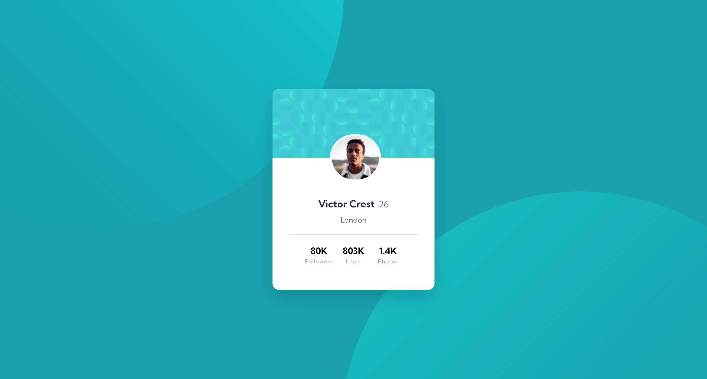
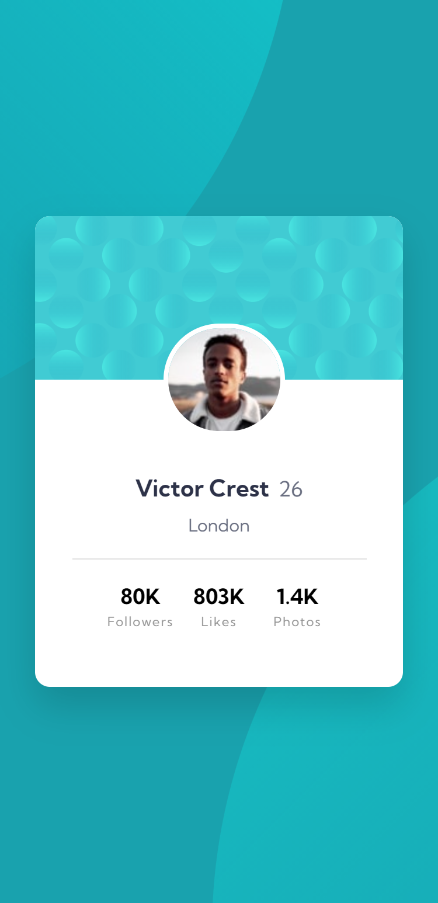

# Frontend Mentor - Profile card component solution

This is a solution to the [Profile card component challenge on Frontend Mentor](https://www.frontendmentor.io/challenges/profile-card-component-cfArpWshJ). Frontend Mentor challenges help you improve your coding skills by building realistic projects. 

## Table of contents

- [Overview](#overview)
  - [The challenge](#the-challenge)
  - [Screenshot](#screenshot)
  - [Links](#links)
- [My process](#my-process)
  - [Built with](#built-with)
  - [What I learned](#what-i-learned)
  - [Continued development](#continued-development)
  - [Useful resources](#useful-resources)
- [Author](#author)

## Overview

### The challenge

- Build out the project to the designs provided

### Screenshot

Desktop



Mobile



### Links

- [Solution URL](#)
- [Live Site URL](#)

## My process

### Built with

- Visual Studio Code
- HTML / CSS
- Sass
- Flexbox
- CSS Grid
- Mobile-first workflow

### What I learned

While I am not entirely happy with this solution for the multiple background images, it is the section that I learned the most from in this project.

```css
body {
  display: flex;
  align-items: center;
  min-height: 100vh;
  background-color: $darkCyan;
  font-family: $ff-kumbh;
  font-weight: $fw-normal;
  position: relative;

  &::before {
    z-index: -1;
    content: '';
    position: absolute;
    width: 100%;
    height: 100%;
    background-image: url(../images/bg-pattern-top.svg);
    background-repeat: no-repeat;
    background-position: 120% 290%;
    mix-blend-mode: overlay;

    @include min-max(tablet, desktop) {
      background-position: -850% 250%;
    }

    @include min(desktop) {
      background-position: -60% 250%;
    }
  }

  &::after {
    z-index: -1;
    content: '';
    position: absolute;
    width: 100%;
    height: 100%;
    background-image: url(../images/bg-pattern-bottom.svg);
    background-repeat: no-repeat;
    background-position: -30% -150%;
    mix-blend-mode: overlay;

    @include min-max(tablet, desktop) {
      background-position: 800% -200%;
    }

    @include min(desktop) {
      background-position: 150% -190%;
    }
  }
}
```

### Continued development

I am not entirely pleased with my solution for the profile picture and medium sized screens.

### Useful resources

- [CSS Box-Shadow](https://developer.mozilla.org/en-US/docs/Web/CSS/box-shadow) - Helpful to understand the settings for the box-shadow CSS property.

## Author

- Frontend Mentor - [@radiantlegends](https://www.frontendmentor.io/profile/radiantlegends)
- Upwork - [Kimberly S.](https://www.upwork.com/freelancers/~0193e4cf5120bb4dc5)
