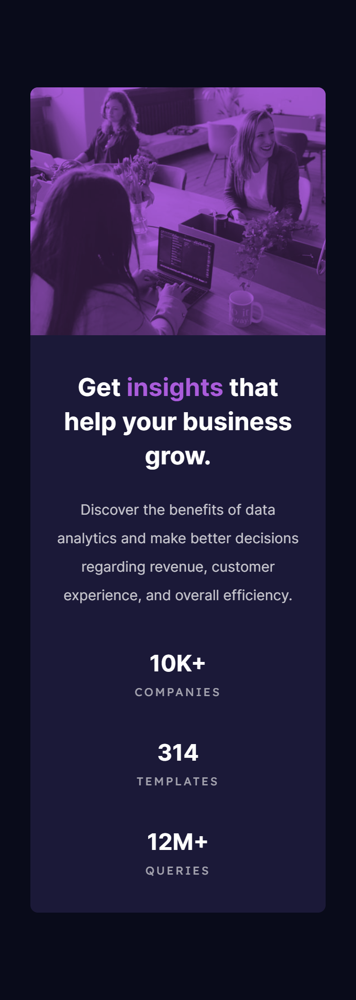

# Frontend Mentor - Stats preview card component solution

This is a solution to the [Stats preview card component challenge on Frontend Mentor](https://www.frontendmentor.io/challenges/stats-preview-card-component-8JqbgoU62). Frontend Mentor challenges help you improve your coding skills by building realistic projects. 

## Table of contents

- [Overview](#overview)
  - [The challenge](#the-challenge)
  - [Screenshot](#screenshot)
  - [Links](#links)
- [My process](#my-process)
  - [Built with](#built-with)
  - [What I learned](#what-i-learned)
  - [Continued development](#continued-development)
  - [Useful resources](#useful-resources)
- [Author](#author)
- [Acknowledgments](#acknowledgments)

## Overview

### The challenge

Users should be able to:

- View the optimal layout depending on their device's screen size

### Screenshot
Desktop

Mobile


### Links

- Solution URL: [Add solution URL here](https://your-solution-url.com)
- Live Site URL: [Add live site URL here](https://your-live-site-url.com)

## My process

### Built with

- Visual Studio Code
- HTML
- Sass
- Flexbox
- CSS Grid

### What I learned

While this challenge offers a simple task, I used this project to test several different methods to position images. At first, I used flexbox only, and found that method messy. I am vastly preferring CSS grids over flexbox for positioning pieces of content, but flexbox is great for vertically centering content quickly.

Overall, I am happiest with the code that changes the color of the image. I find it completely unnecessary when editing the picture in Photoshop would be infinitely more efficient in this scenario, but the process encouraged some interesting problem solving regarding rendering order, blending, and opacity.


```css
.img-component {
  background-color: $softViolet;
  position: relative;

  img {
    width: 100%;
    height: 100%;
    object-fit: cover;
    mix-blend-mode: multiply;
  }

  &::after {
    content: '';
    position: absolute;
    width: 100%;
    height: 100%;
    top: 0;
    left: 0;
    background-color: $softViolet;
    opacity: 0.25;
  }
}
```


### Continued development

If I were to continue working with this project, I would focus more on the design for medium-sized screens. Certain elements get too close together at certain resolutions, but the key resolutions look alright.

I used a different naming structure for this project than the last, but I am still not completely satisfied with this organization and naming system.

### Useful resources

- [A Complete Guide to Flexbox](https://css-tricks.com/snippets/css/a-guide-to-flexbox/) - While attempting to use only flexbox elements, this guide held my hand throughout the entire process.

## Author
- Frontend Mentor - [@radiantlegends](https://www.frontendmentor.io/profile/radiantlegends)
- Upwork - [Kimberly S.](https://www.upwork.com/freelancers/~0193e4cf5120bb4dc5)


## Acknowledgments

[Mr Coder](https://youtu.be/dhBR6-Jjql4) - This video was one of many that I looked at for help positioning images, and ultimately was the method I preferred the most. This solution brought me away from attempting to use only flexbox, and introduced me about the "object-fit" property.